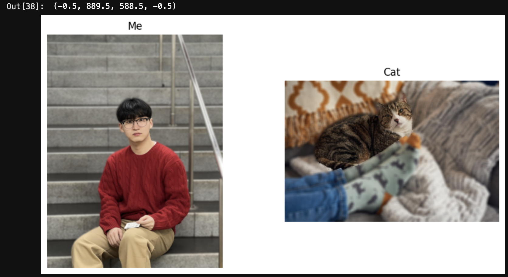
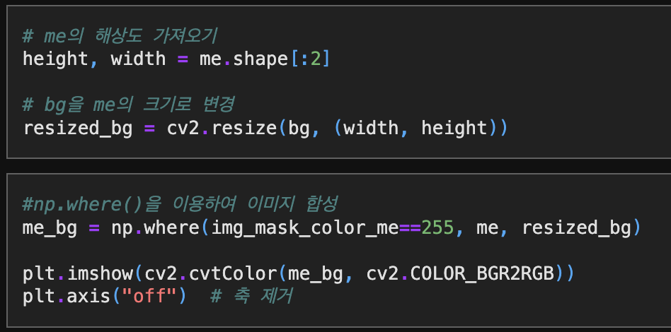
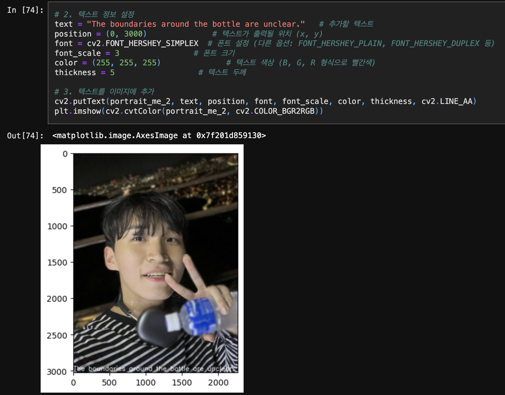
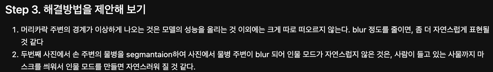
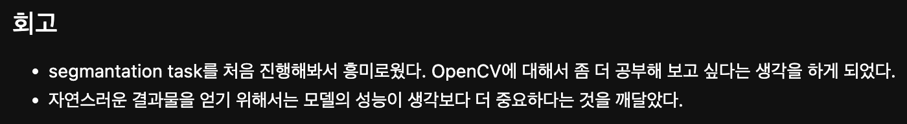
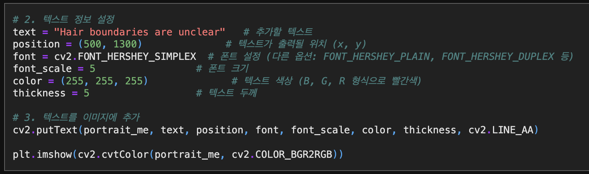

# AIFFEL Campus Online Code Peer Review Templete
- 코더 : 김민호
- 리뷰어 : 홍예린


# PRT(Peer Review Template)
- [X]  **1. 주어진 문제를 해결하는 완성된 코드가 제출되었나요?**
    
    
    - 배경을 흐리게 만드는 것이나 인물을 흐리게 만드는 것 모두 수행
    - 인물을 크롭하고 새로운 배경에 삽입하는 것 역시 수행
    - 중간 중간 진행 사항을 출력해서 확인
    
- [X]  **2. 전체 코드에서 가장 핵심적이거나 가장 복잡하고 이해하기 어려운 부분에 작성된 
주석 또는 doc string을 보고 해당 코드가 잘 이해되었나요?**
    
    - 추가적인 실험인 크로마키를 수행할 때 백그라운드 크기를 조절하는 부분을 주석과 함께 작성하여 이해하기 쉬움
        
- [X]  **3. 에러가 난 부분을 디버깅하여 문제를 해결한 기록을 남겼거나
새로운 시도 또는 추가 실험을 수행해봤나요?**
    
    - 추가적인 사진을 통하여 바운더리 부분을 잘 인식 못 하는 것을 확인
    - 해드셋이 LABEL_NAMES에 없어서 물병으로 같이 인식한 듯

    
    - 문제를 분석하고 해결 방법을 고려하여 새로운 실험을 진행
        
- [X]  **4. 회고를 잘 작성했나요?**
    
    - 모델이 전반적으로 경계 부분을 분할하는 데에 어려움이 있었는데, 이를 통해 모델 성능의 중요성을 느낀 부분을 회고를 통해 알 수 있었음
    - 영상처리에 재미를 느끼신 듯!
        
- [X]  **5. 코드가 간결하고 효율적인가요?**
    
    - 텍스트를 이용하여 추가적으로 결과 사진에 정보를 남겼는데, 이때 짧은 코드임에도 변수를 활용하여 이해하기 쉽고 간결한 코드를 작성함


# 회고(참고 링크 및 코드 개선)
```
- 발이랑 고양이 같이 있는 사진에서 모델이 발을 인식한 것이 흥미로웠음!
- 테스트에 활용하신 이미지를 나중에 나도 해보면 재밌겠다고 느낌!
- 간결하고 가독성 좋은 코드!! 완벽!
```
