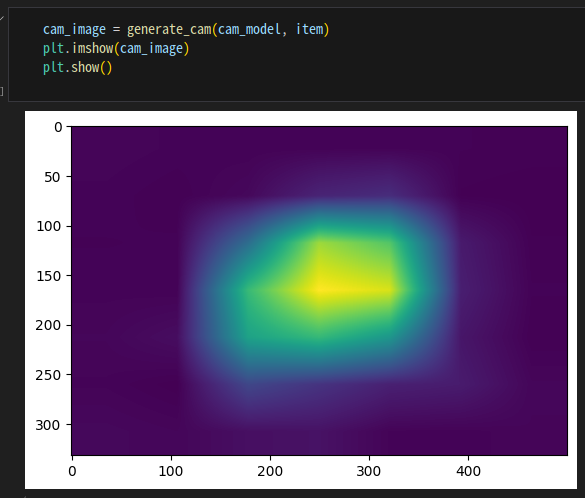
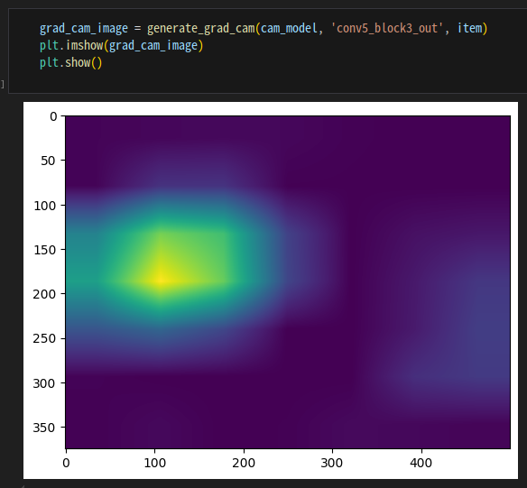
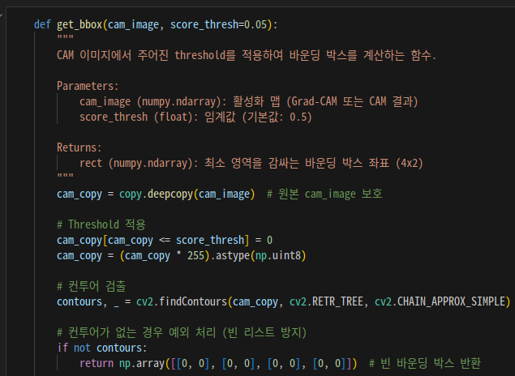
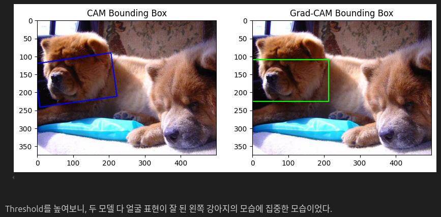
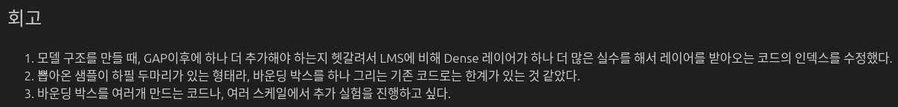
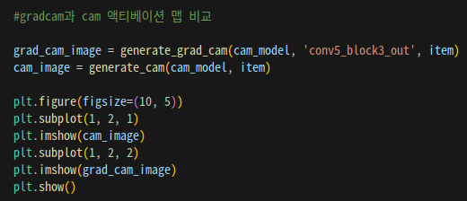

# AIFFEL Campus Online Code Peer Review Templete

- 코더 : 김민호
- 리뷰어 : 홍예린

# PRT(Peer Review Template)

- [X] **1. 주어진 문제를 해결하는 완성된 코드가 제출되었나요?
  
  **

  - CAM 함수와 Grad CAM 함수를 구현하여 이미지를 확인
- [X] **2. 전체 코드에서 가장 핵심적이거나 가장 복잡하고 이해하기 어려운 부분에 작성된
  주석 또는 doc string을 보고 해당 코드가 잘 이해되었나요?
  **

  - Bounding box의 위치를 뽑아내는 함수
  - 함수가 수행하는 기능이나 input/output에 대한 정의가 있어서 이해하기 쉬움
- [X] **3. 에러가 난 부분을 디버깅하여 문제를 해결한 기록을 남겼거나
  새로운 시도 또는 추가 실험을 수행해봤나요?
  **

  - Bounding box를 그릴 때 threshold를 조절해서 어떤 부분에 모델이 더 집중하는지 확인
- [X] **4. 회고를 잘 작성했나요?
  **

  - 이 외에도 CAM과 Grad-CAM의 차이나 성능에 대해 구두로 배운점과 아쉬운점, 느낀점 등이 기록되어 있는지 확인
- [X] **5. 코드가 간결하고 효율적인가요?
  **

  - cam 이미지를 생성하는 코드를 함수화하여 편리하게 비교 가능
  - 이미지도 한 번에 깔끔히 보여주어 비교가 쉬움

# 회고(참고 링크 및 코드 개선)

```
- cam/grad-cam 이미지를 한 번에 보니 비교가 쉬웠음
- 강아지가 두 마리 있는 사진이 테스트용으로 뽑혔는데 threshold를 조절해서 어떤 강아지에 집중하는지 볼 수 있어서 흥미로웠음
- 함수에 주석을 많이 달아서 이해하기가 쉬웠음
```
